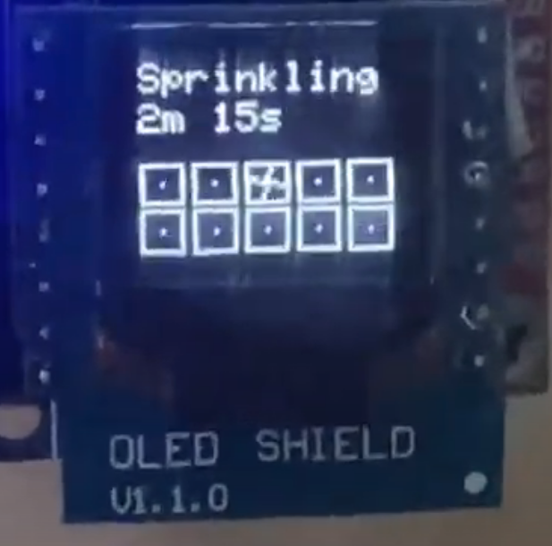

# Sprinkle Now!

Sprinkle Now! is an Arduino project intended to run on a Wemos-D1-Mini-like esp8266 board with a D1 mini OLED shield to display status. My C/C++ is terrible, but it works. A small circuit and relay control baord is needed to control typical 24 VAC sprinkler valves. I bought a cheap [ACLD-9182A-01](https://www.adlinktech.com/Products/Data_Acquisition/TerminalBoards/ACLD-9182A-01) board off of ebay and designed a small circuit using shift registers to control it with this project.

This started as a learning project, and I actually use Sprinkle Now! to manage 10 sprinkler zones at my home. There's currently no schedule support, so just manual zone runs for now. A simple web interface allows control of zones. To minimize chances for flooding zone run times are maxed at 30 minutes (`MAX_RUN_TIME_MINUTES`). To minimize chances of insufficient water pressure, a max of one zone at a time is allowed by default (`MAX_ACTIVE_ZONES`). OLED UI example can be seen here: https://youtu.be/4q2UL6wEzQA

Ten Zones are currently hard-coded for my home, though technically 16 could work.

## Warranty
This code isn't intended for your use. You could easily cause a fire or flood which is really bad so just don't use it.

Disclaimer of Warranties; Limitation of Liability THIS PROGRAM IS PROVIDED "AS IS" WITHOUT WARRANTY OF ANY KIND. I FURTHER DISCLAIM ALL WARRANTIES, EXPRESS AND IMPLIED, INCLUDING WITHOUT LIMITATION, ANY IMPLIED WARRANTIES OF MERCHANTABILITY, FITNESS FOR A PARTICULAR PURPOSE, OR NONINFRINGEMENT.

## License
[MIT](https://choosealicense.com/licenses/mit/)
